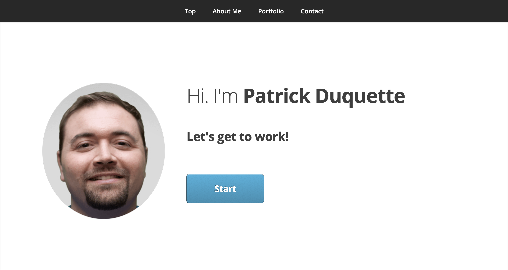

# Patrick Duquette Portfolio Page

## Problem
I wanted to create a professional portfolio to showcase my work and provide a resource for potential employers to get to know me a little.

## Organization
This page uses a header with selectable links that redirect the user to the corresponding section. 

## Instructions
This is a live website. Go to http://patrickduquette.com to view. 

I used namecheap to register the domain. I also set up webmail with a custom domain. It's patrick@patrickduquette.com. Send me an email, or use the contact me form on the webdite. It works great. 

## Screenshot:

## Acknowledgements
This page was made using a template created by:
Miniport by HTML5 UP
html5up.net | @ajlkn
Free for personal and commercial use under the CCA 3.0 license (html5up.net/license)

A super simple responsive portfolio template. It's only a single page because hey, sometimes
you don't need a half dozen pages to make your point.

Credits:
	Form:
		formspree.io

	Icons:
		Font Awesome (fontawesome.io)

	Other:
		jQuery (jquery.com)
		Responsive Tools (github.com/ajlkn/responsive-tools)
